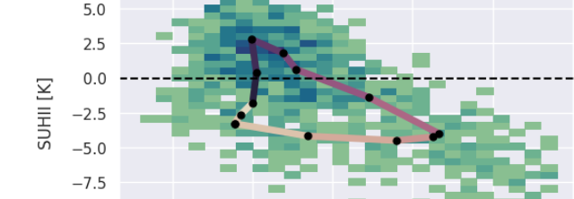

# BUCSS22
Course materials from the 2022 Bochum Urban Climate Summer School (Germany)

## Context
The first three editions of BUCSS took place in Bucharest (Romania) (see e.g. [here](https://icub.unibuc.ro/events/bucss2019/) for 2019). 
This 4th edition took place from 26 to 29 September 2022 at Ruhr-University Bochum (Germany), and aimed at 1) providing a general introduction to different facets of urban climatology with a special focus on urban climate informatics, 2) providing structured information and skill-building capabilities related to urban climate monitoring, remote sensing and modelling, and 3) strengthening an active pool of young scientists to tackle the major urban sustainability challenges of future generations.

Official website: [https://www.climate.ruhr-uni-bochum.de/bucss/](https://www.climate.ruhr-uni-bochum.de/bucss/) 

## Course materials
The programme consists out of state-of-the-art lectures and hands-on tutorials on remote sensing in urban areas, crowdsourcing and urban climate modelling. All of these teaching resources are available below.  

 

### Lectures
- - -

#### _Monday 26.09_
- **Student self-presentations**: a compressed archive of all presentations is available [here](https://github.com/RUBclim/BUCSS22/blob/main/lectures/student_self-presentations.tar.xz)
- **Gerald Mills**: 
- **Andreas Christen**:
- **Benjamin Bechtel**:
- **Simone Kotthaus**: 
- **Matthias Demuzere**: [Introduction to Google Colaboratory](https://github.com/RUBclim/BUCSS22/blob/main/lectures/Demuzere_GoogleColab_Intro.pdf)

#### _Tuesday 27.09_
- **Ariane Middel**: [Urban Climate Informatics](https://github.com/RUBclim/BUCSS22/blob/main/lectures/Middel_UCI.pdf)
- **Negin Nazarian**: 
- **Daniel Fenner**: [Crowdsourcing Crowd (Citizen) Weather Station Data](https://github.com/RUBclim/BUCSS22/blob/main/lectures/Fenner_Crowdsourcing_CWS.pdf)
- **Matthias Demuzere**: [Introduction to Google Earth Engine](https://github.com/RUBclim/BUCSS22/blob/main/lectures/Demuzere_GoogleEarthEngine.pdf)

#### _Wednesday 28.09_
- **Leena Järvi**: [General introduction to urban climate modelling](https://github.com/RUBclim/BUCSS22/blob/main/lectures/Jarvi_modelling.pdf)
- **Robert Rauterkus**: [Introduction to PALM](https://geo-cloud.geographie.ruhr-uni-bochum.de/index.php/s/ETN9z2kGkyz3DG3)
- **Helen Claire Ward**: [Evaluating urban climate models](https://github.com/RUBclim/BUCSS22/blob/main/lectures/Ward_ModelEvaulation.pdf)

#### _Thursday 29.09_
- **Andrea Zonato**: [Introduction to (urban climate modelling with) WRF](https://github.com/RUBclim/BUCSS22/blob/main/lectures/Zonato_WRF.pdf)
- **Matthias Demuzere and Andrea Zonato**: [Guidelines for the WRF hands-on session](https://github.com/RUBclim/BUCSS22/blob/main/lectures/Demuzere_Zonato_WRF-HandsOn.pdf)

 

### Hands-on sessions
- - -

During the school, all Python notebooks were executed in [Google Colaboratory](https://colab.research.google.com/), reading and writing information from a dedicated Google Drive. As you will probably be using these notebooks outside this environment, make sure to take care of your own Python environment and directory definitions. 

 

#### _1. Process ESA CCI LST/SUHI data_

This hands-on is composed out of two parts:

1. Process MODIS LST data and calculate zonal statistics ([Python notebook](notebooks/LST_Exercise_partA.ipynb))
2. Open the SUHI database for Mexico, developed in the [ENLIGHT project](https://www.climate.ruhr-uni-bochum.de/research/projects/enlight/), and process it in a number of ways, leading to the SUHII seasonal hysteresis as published in [Sismanidis et al. 2022](http://doi.org/10.3390/rs14102318) ([Python notebook](notebooks/LST_Exercise_partB.ipynb)).

These hands-ons require the following files that can be downloaded from [here](https://geo-cloud.geographie.ruhr-uni-bochum.de/index.php/s/RHBWQiSinZmotQr), under `LST/`:

* `ESACCI-LST-MODIST-RUBMEX-2018-D.nc`: MODIS LST data
* `mexico_cities.tif`: raster layer with urban boundaries
* `SUHI_DB-MOD11A1.061-v1.0.1.db`: excerpt of SUHI database developed in the [ENLIGHT project](https://www.climate.ruhr-uni-bochum.de/research/projects/enlight/)
* `SUHII_monthly_means.db`: excerpt of SUHI database developed in the [ENLIGHT project](https://www.climate.ruhr-uni-bochum.de/research/projects/enlight/)

 

#### _2. Quality control CWS data with CrowdQC+_

Goal of this workshop is to learn how to apply the quality-control package [CrowdQC+](https://doi.org/10.3389/fenvs.2021.720747) on an excerpt of the global CWS database compiled in the [ENLIGHT project](https://www.climate.ruhr-uni-bochum.de/research/projects/enlight/).

Via this [Python notebook](notebooks/crowdqcplus_application.ipynb) you learn how to:

- use R in a Python environment
- get hands-on experience with real crowdsourced CWS data
- investigate issues with such data
- use CrowdQC+ to quality-control such data
- do some first analyses with the quality-controlled data

This hands-on requires the `cws_data_cqcp_hands_on.csv` file available from [here](https://geo-cloud.geographie.ruhr-uni-bochum.de/index.php/s/RHBWQiSinZmotQr) under `CWS/`

 

#### _3. Greenest German city in Google Earth Engine_

In [this interactive newspaper article](https://interaktiv.morgenpost.de/gruenste-staedte-deutschlands/), published in the Berliner Morgenpost May 10 2016, the authors used the Landsat archive in Google Earth Engine to estimate the "greenest" large (>100 000 inhabitants) city in Germany.   

The goal of this hands-on is the replicate this work, using Sentinel-2 information instead. The procedure consist out of three steps:

1. Create a database with relevant cities ([Python notebook](notebooks/GEE_prep_city_data.ipynb))
2. Add greennees to this database ([GEE javascript](notebooks/greenest_city_germany.js))
3. Display the results ([Python notebook](notebooks/GEE_plot_city_data.ipynb))

This hands-on requires the `05-staedte.xlsx` and `gadm41_DEU_4.json` files available from [here](https://geo-cloud.geographie.ruhr-uni-bochum.de/index.php/s/RHBWQiSinZmotQr) under `GEE/`

 

#### _4. WRF evaluation and roottop mitigation strategies_

For this hands-on, 6 WRF simulations are pre-computed, covering the Ruhr-Area (Germany) and heatwave period between 20 - 28 July 2019. Further details on the model's configuration and simulation details are provided in the [WRF hands-on slides](https://github.com/RUBclim/BUCSS22/blob/main/lectures/Demuzere_Zonato_WRF-HandsOn.pdf).

Two notebooks are developed to complete this exercise:
- [WRF_functions.ipynb](notebooks/WRF_functions.ipynb): a notebook that contains a set of pre-scripted functions to read, manipulate and evalute all WRF input and output, the latter in combination with CWS observations (no changes needed in this one).
- [WRF_functions.ipynb](notebooks/WRF_functions.ipynb): a notebook to read, manipulate and evalute all WRF input and output, the latter in combination with CWS observations. It also allows you to assess the impact of the rooftop mitigation strategies (RMS) compared to the baseline simulation without RMS.

These hands-ons require a bunch of files available from [here](https://geo-cloud.geographie.ruhr-uni-bochum.de/index.php/s/RHBWQiSinZmotQr) under:

* `WRF_CWS/`:
  * `netatmo_heatwave_2019_bucss.csv`: quality-controlled timeseries of 5000+ CWS stations in the Ruhr-area, for the period 21-28 July 2019.
  * `netatmo_heatwave_2019_bucss_metadata.csv`: metadata for all above-mentioned CWS stations

* `WRF/`:
  * `INPUT/`: the required geo_em*.nc files to run the various WRF simulations. Note that:
    * the Local Climate Zone map for the Ruhr area was extracted from the global map of Local Climate Zones [(Demuzere et al., 2022)](https://doi.org/10.5194/essd-14-3835-2022). 
    * the [W2W package](https://doi.org/10.21105/joss.04432) was used to insert the LCZ-based urban description.

  * `OUTPUT/`: output files for all WRF simulations. 

Please see  [WRF hands-on slides](https://github.com/RUBclim/BUCSS22/blob/main/lectures/Demuzere_Zonato_WRF-HandsOn.pdf) for further details.